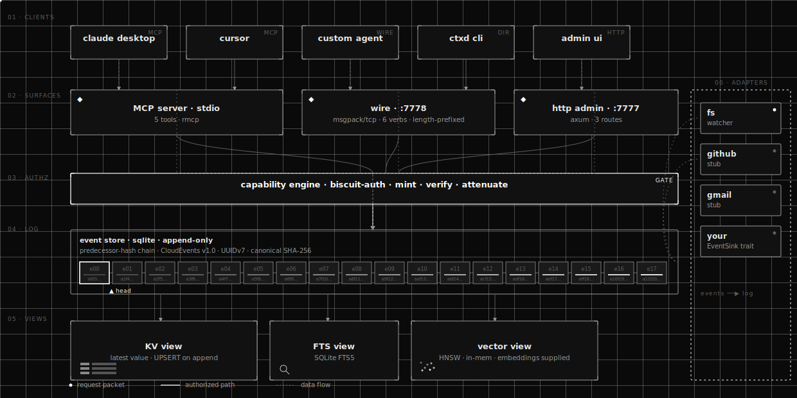

<p align="center">
  <picture>
    <source media="(prefers-color-scheme: dark)" srcset="assets/img/logo-dark.svg">
    
  </picture>
</p>

<h1 align="center">ctxd</h1>

<p align="center"><strong>Context substrate for AI agents.</strong> A single-binary daemon that gives every agent — Claude Desktop, Cursor, your own code — one place to write and read shared context, with capability tokens, federation, and a native MCP server.</p>

<p align="center">
  <a href="https://github.com/keeprlabs/ctxd/releases"></a>
  <a href="https://github.com/keeprlabs/ctxd/actions/workflows/ci.yml"></a>
  <a href="LICENSE"></a>
  <a href="https://github.com/keeprlabs/ctxd/stargazers"></a>
</p>

```bash
brew install keeprlabs/tap/ctxd
ctxd onboard
```

`ctxd onboard` installs ctxd as a background service, configures Claude Desktop / Claude Code / Codex to use it over MCP, mints scoped capability tokens per app, and seeds a baseline `/me/**` so every connected AI starts with non-empty context. One command, two minutes, your AI tools share memory.

---

## Why ctxd

Every AI agent starts each session with amnesia. Context is scattered across Gmail, Slack, GitHub, Notion, and chat windows. None of those tools share a view, and your AI re-derives state from scratch every time.

ctxd is the place that context lives. Write once over MCP or HTTP, query from any agent, prove what was written via Ed25519 signatures, replicate to peer nodes you trust. Not a vector DB, not an agent framework, not a knowledge graph — a substrate the rest of those things plug into.

## Quickstart

```bash
# 1. Install
brew install keeprlabs/tap/ctxd

# 2. One-time setup (installs the daemon as a service,
#    configures Claude Desktop / Code / Codex)
ctxd onboard

# 3. Use any of your AI tools — they all share the same memory now.
#    Or write directly via the CLI:
ctxd write --subject /work/notes/standup --type ctx.note \
  --data '{"content":"Ship auth by Friday"}'
ctxd read --subject /work --recursive
```

`ctxd onboard` is idempotent — re-running it updates configs and re-mints caps without losing data. Use `ctxd offboard` to fully reverse the install (restore client configs from snapshot, stop the service, optionally delete the DB with `--purge`). See [docs/onboarding.md](docs/onboarding.md) for the full step-by-step.

You now have eight MCP tools wired to your context: `ctx_write`, `ctx_read`, `ctx_subjects`, `ctx_search`, `ctx_subscribe`, `ctx_entities`, `ctx_related`, `ctx_timeline`.

### Foreground / advanced

If you'd rather run ctxd in a terminal tab without installing a service, use `ctxd serve` directly:

```bash
ctxd serve                   # HTTP admin :7777, MCP on stdio
```

You'll need to wire Claude Desktop / Code / Codex by hand. The MCP entry is documented in [docs/onboarding.md](docs/onboarding.md#manual-client-config).

## See it run

The same flow against a real daemon — write, read, grant, serve. Generated from [`assets/vhs/terminal.tape`](assets/vhs/terminal.tape).


## Dashboard

```bash
ctxd dashboard
```

Opens an embedded web UI at `http://127.0.0.1:7777/`. See your event count fill up, browse the subject tree, search the log, watch new events stream in live via SSE. Read-only by default — writes still go through MCP, the wire protocol, or the CLI. Localhost-only with DNS-rebinding defenses (host-header check, CSP, X-Frame-Options).

If `ctxd serve` is already running, point your browser at `http://127.0.0.1:7777/` directly — the dashboard ships in the daemon, not as a separate process. See [docs/dashboard.md](docs/dashboard.md) for the security model and what each view shows.

## How it fits

<p align="center">
  
</p>

The event log is append-only. Views (KV, FTS, vector, graph, temporal) are derived from it and rebuildable from it. See [docs/architecture.md](docs/architecture.md) for the full picture, or the live landing page at [keeprlabs.github.io/ctxd](https://keeprlabs.github.io/ctxd/) for the animated diagram in context.

## Features

| Feature | Description |
|---------|-------------|
| **Multi-transport** | One binary speaks HTTP admin (`:7777`), MessagePack wire (`:7778`), and MCP over stdio + SSE + streamable-HTTP — concurrently, off the same tool surface |
| **Tamper-evident log** | Append-only event log, predecessor hash chains, Ed25519 signatures, causal-DAG `parents` for deterministic conflict resolution |
| **Capability tokens** | Biscuit-based, attenuable, bearer. Stateful caveats: budget limits, human approval, rate limits |
| **Storage backends** | SQLite (default), Postgres (clustered FTS via `tsvector`), DuckDB-on-object-store (Parquet on S3 / R2 / local fs) — all behind one `Store` trait + conformance suite |
| **Federation** | Two nodes peer with one command, replicate subjects bidirectionally, resume from cursors after a crash, backfill missing parents on causal-DAG gaps |
| **Hybrid search** | Pluggable embedder (OpenAI, Ollama, none); persisted HNSW vector index + FTS fused via Reciprocal Rank Fusion |
| **Real adapters** | Gmail (OAuth2 + AES-256-GCM token at rest + History API). GitHub (PAT + ETag caching + rate limits) |
| **Three SDKs** | Rust, Python, TypeScript — all pinned to the same `docs/api/` conformance corpus the daemon runs |

## Install

### Homebrew (macOS, Linux)

```bash
brew install keeprlabs/tap/ctxd
```

### curl | sh

```bash
curl -fsSL https://github.com/keeprlabs/ctxd/releases/latest/download/install.sh | sh
```

Auto-detects OS + arch, verifies the published sha256, drops the binary in the first writable directory on `$PATH`. Override with `CTXD_INSTALL_DIR=...` (set it on the `sh` side of the pipe).

### From source

```bash
git clone https://github.com/keeprlabs/ctxd && cd ctxd
cargo build --release
# add --features storage-postgres,storage-duckdb-object for the heavier backends
```

Pre-built tarballs for macOS arm64/x86_64 and Linux x86_64/aarch64 are attached to every [release](https://github.com/keeprlabs/ctxd/releases).

## Build a client

The three first-party SDKs all wrap the same HTTP admin + wire protocol surface. Each pins to the same [`docs/api/`](docs/api/) contract.

| Language | Install | Status |
|----------|---------|--------|
| Rust | `cargo add ctxd-client` ([README](clients/rust/ctxd-client/README.md)) | v0.3 — published |
| Python | `pip install ctxd-client` (imports as `ctxd`, [README](clients/python/ctxd-py/README.md)) | v0.3 — published |
| TypeScript | `npm i @ctxd/client` ([README](clients/typescript/ctxd-client/README.md)) | v0.3 — published |

The Rust SDK is the source of truth; the Python and TypeScript packages mirror it. All three run the same MessagePack hex fixtures and JSON Schema corpus the daemon runs.

```rust
use ctxd_client::CtxdClient;
let client = CtxdClient::connect("http://127.0.0.1:7777").await?
    .with_wire("127.0.0.1:7778").await?;
let id = client.write("/work/notes", "ctx.note", json!({"hi": "there"})).await?;
```

## Going further

| Topic | Link |
|-------|------|
| Architecture, data flow, crate map | [docs/architecture.md](docs/architecture.md) |
| Events: schema, canonical form, hash chain | [docs/events.md](docs/events.md) |
| Subjects: path syntax, recursive reads | [docs/subjects.md](docs/subjects.md) |
| Capabilities: biscuit tokens, caveats | [docs/capabilities.md](docs/capabilities.md) (+ [hands-on](docs/capability-tutorial.md)) |
| MCP: tool reference + transports | [docs/mcp.md](docs/mcp.md) |
| Federation: two-node tutorial | [docs/federation.md](docs/federation.md) |
| Embeddings + hybrid search | [docs/embeddings.md](docs/embeddings.md) |
| Postgres / DuckDB+S3 backends | [storage-postgres.md](docs/storage-postgres.md) · [storage-duckdb-object.md](docs/storage-duckdb-object.md) |
| Adapters: Gmail, GitHub, authoring guide | [adapters/](docs/adapters/) · [adapter-guide.md](docs/adapter-guide.md) |
| Benchmarks (HNSW, FTS, federation) | [benchmark-results.md](docs/benchmark-results.md) |
| API contract artifact (OpenAPI + JSON Schema + msgpack hex) | [docs/api/](docs/api/) |
| Architecture decisions (19 ADRs) | [docs/decisions/](docs/decisions/) |

## Development

```bash
cargo test --workspace                       # ~425 tests (default features)
cargo test --workspace --all-features        # adds postgres + duckdb suites
cargo clippy --workspace --all-targets -- -D warnings
cargo fmt --all --check
```

CI runs the Postgres conformance suite against a `postgres:16` service container. The full matrix lives in [`.github/workflows/ci.yml`](.github/workflows/ci.yml).

## Contributing

Bugs, features, and adapter PRs all welcome.

- File issues at [github.com/keeprlabs/ctxd/issues](https://github.com/keeprlabs/ctxd/issues).
- For new adapters, start with [docs/adapter-guide.md](docs/adapter-guide.md) — the trait is stable.
- Open PRs against `main`. CI must be green; clippy and `cargo fmt --check` are gates.
- We aim to triage every PR within a few days.

## License

Apache-2.0
