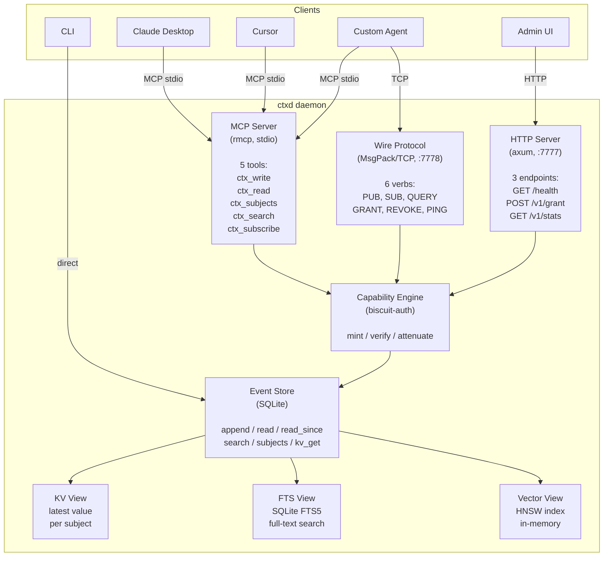
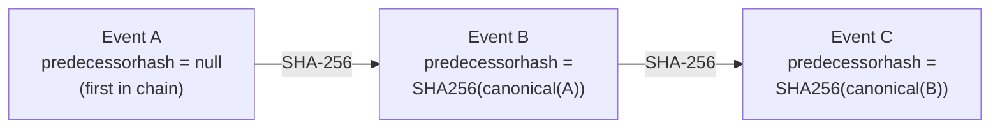
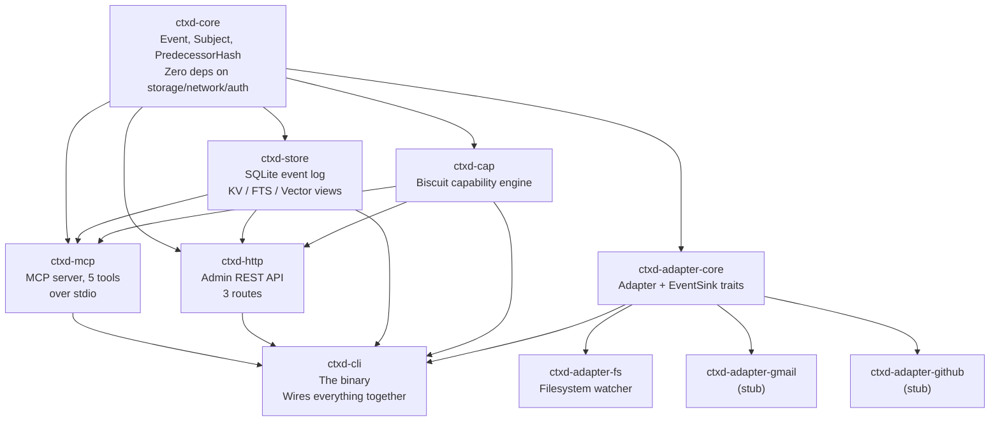
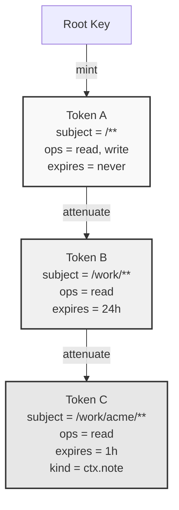
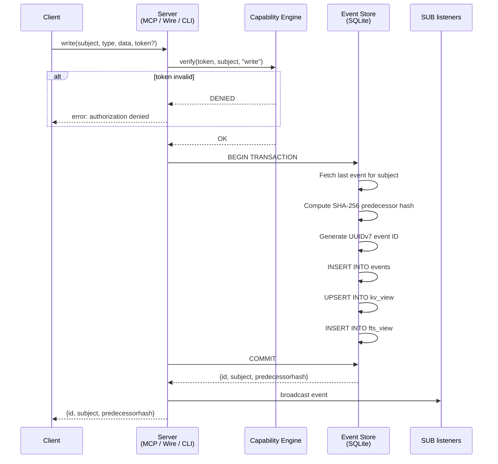
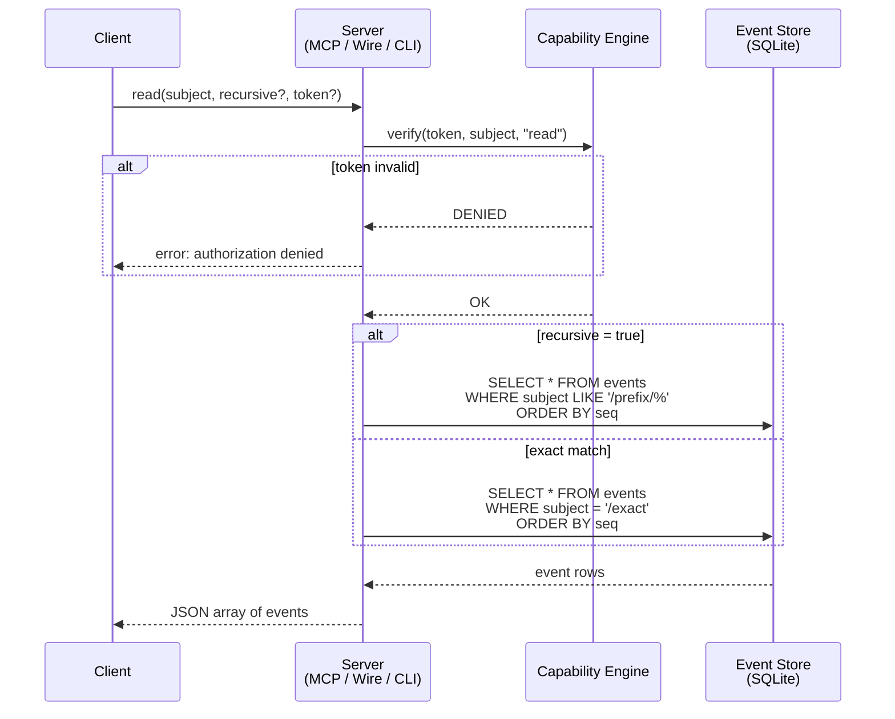
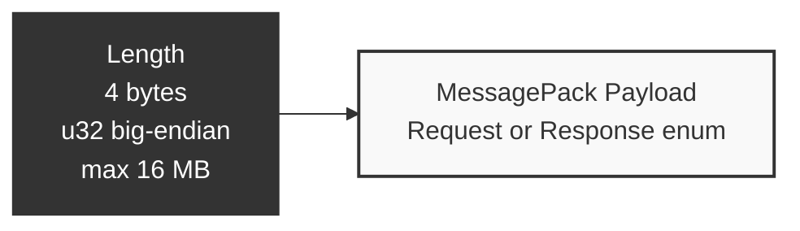

# Architecture

How ctxd works, how data flows through it, and how the pieces fit together. Written for engineers who want to understand, extend, or audit the system.

## What ctxd does

ctxd is a daemon that stores and serves context for AI agents. Context is anything an agent might need: notes, documents, customer data, code changes, meeting summaries, file contents. It enters as events, gets indexed into materialized views, and leaves via MCP tool calls, wire protocol queries, or HTTP endpoints.

One binary. SQLite by default — Postgres available for operators who want a managed datastore. No external services required.

Storage backends live behind the [`Store`](../crates/ctxd-store-core/src/lib.rs) trait (v0.3+); see ADR 017 for the conformance pattern that gates every backend, ADR 016 for the Postgres schema choices, and `docs/storage-postgres.md` for operator setup.

## System overview



## Data model

### Events

Everything in ctxd is an event. Events follow CloudEvents v1.0 with two extensions.

| Field | Type | Description |
|-------|------|-------------|
| `specversion` | `"1.0"` | Always 1.0 |
| `id` | UUIDv7 | Time-ordered, globally unique |
| `source` | string | Who produced this (e.g., `"ctxd://cli"`) |
| `subject` | string | Path-based address (e.g., `"/work/acme/notes"`) |
| `type` | string | Event kind (e.g., `"ctx.note"`) |
| `time` | RFC3339 | When the event was created |
| `datacontenttype` | string | Always `"application/json"` |
| `data` | JSON | Any JSON payload |
| `predecessorhash` | string | SHA-256 of previous event's canonical form (ctxd extension) |
| `signature` | string | Ed25519 signature (v0.2, ctxd extension) |

### Predecessor hash chain



Canonical form for hashing: exclude `predecessorhash` and `signature`, sort keys alphabetically, serialize to JSON bytes, SHA-256.

Hash chains are scoped per subject. Events on `/work/acme` and `/personal/journal` have independent chains. If any event is modified after the fact, the next event's predecessor hash will not match, and the chain breaks.

### Subjects

```
/                              root (parent of everything)
/work                          work namespace
/work/acme                     organization
/work/acme/customers/cust-42   specific entity
/personal/journal/2025-01-15   personal entry

Recursive read:
  read("/work/acme", recursive=true)
  matches: /work/acme, /work/acme/customers/cust-42, /work/acme/notes/standup
  does NOT match: /work/other, /working

Glob patterns (for capabilities):
  /**           everything
  /work/**      /work and all descendants
  /work/*       direct children of /work only (not grandchildren)
```

### Materialized views

All views are derived from the append-only event log and can be rebuilt from it.

| View | What it stores | Use case | Implementation |
|------|---------------|----------|----------------|
| **KV** | Latest event data per subject | "Current state of customer cust-42?" | SQLite table, UPSERT on append |
| **FTS** | Full-text index over event data | "Find everything mentioning 'enterprise plan'" | SQLite FTS5 virtual table |
| **Vector** | HNSW nearest-neighbor index | "10 most semantically similar events" | instant-distance crate, in-memory, rebuilt on restart |

ctxd does NOT generate embeddings. Users supply them.

## Crate dependency graph



## Capability model



Each level can only narrow scope. Never widen.

**Caveat types in v0.1:**

| Caveat | Purpose |
|--------|---------|
| SubjectMatches | Glob pattern restricting which paths the token can access |
| OperationAllowed | Which operations: read, write, subjects, search, admin |
| ExpiresAt | Timestamp after which the token is invalid |
| KindAllowed | Restrict to specific event types (e.g., only `ctx.note`) |
| RateLimit | Ops/sec cap (stored in token, enforcement is v0.2) |

Verification is datalog-injection-safe. All user inputs are validated against `"`, `)`, `;`, and newline before interpolation into biscuit authorizer code.

## Write path



All steps inside the transaction are atomic. Crash at any point = rollback, views stay consistent with the log.

## Read path



## Wire protocol framing



Every message on the TCP wire is length-prefixed. The length field is a 4-byte big-endian unsigned integer. The payload is a MessagePack-encoded request or response enum. Maximum payload size is 16 MB.

## SQLite schema

```sql
events           -- append-only event log (seq, id, source, subject, type, time, data, predecessorhash)
kv_view          -- latest value per subject (subject PK, data, updated_at)
fts_view         -- FTS5 virtual table (event_id, subject, event_type, data)
metadata         -- daemon config (key-value, stores root capability key)
```

Indexes on events: `subject`, `time`, `event_type`.

## What v0.1 does NOT include

| Feature | Target | Reason |
|---------|--------|--------|
| Federation | v0.3 | Needs conflict resolution, peer discovery |
| Ed25519 signatures | v0.2 | Key management UX |
| Token revocation | v0.2 | Needs revocation list |
| Graph view | v0.2 | Needs LLM extraction |
| Temporal queries | v0.2 | Needs point-in-time reconstruction |
| Postgres backend | v0.3 | Shipped — `ctxd-store-postgres` (ADR 016) |
| DuckDB+object-store backend | v0.3 (in flight) | Phase 5B parallel agent |
| Embedding generation | never | ctxd stores, not generates |
| EventQL parser | v0.2 | Basic LIKE filter for v0.1 |
| MCP over SSE/HTTP | v0.2 | stdio only |
