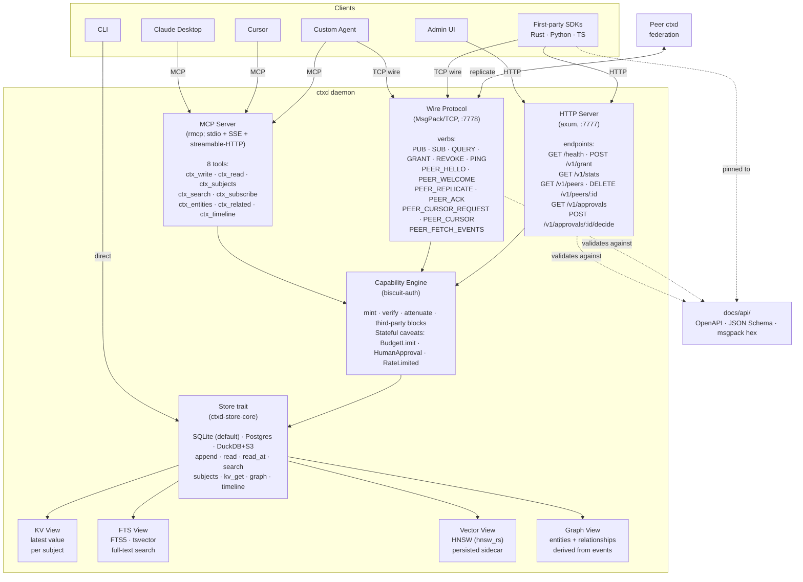
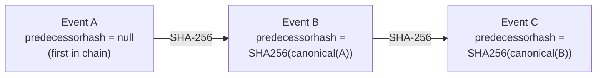
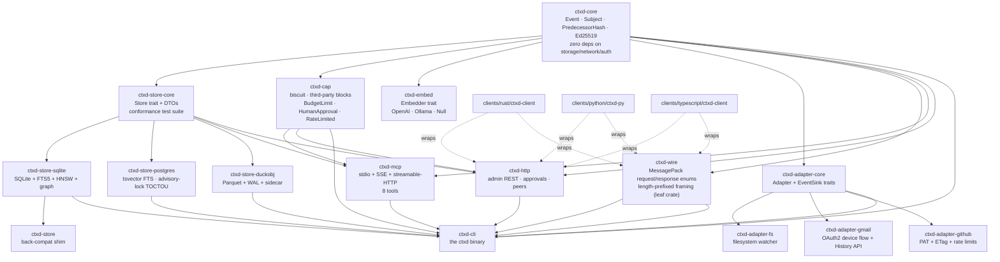
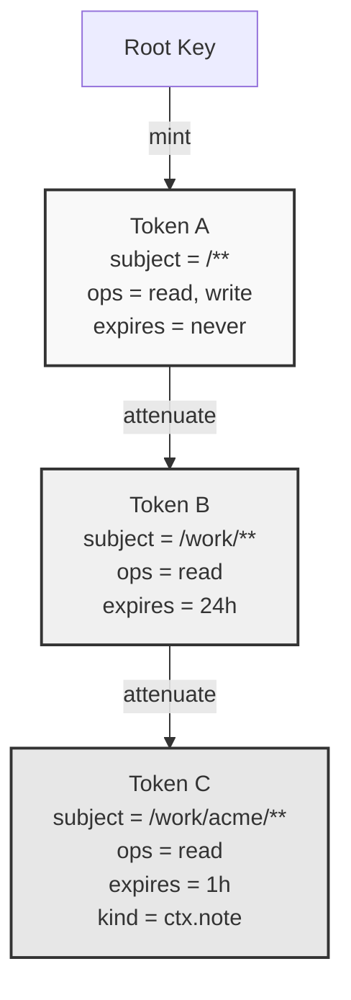
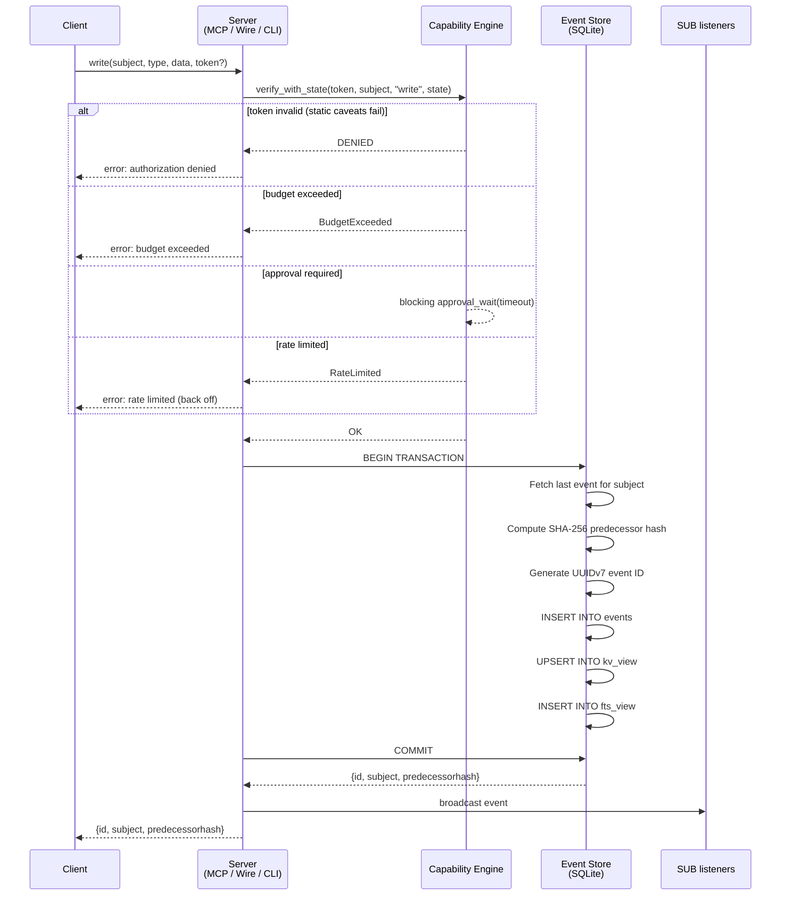
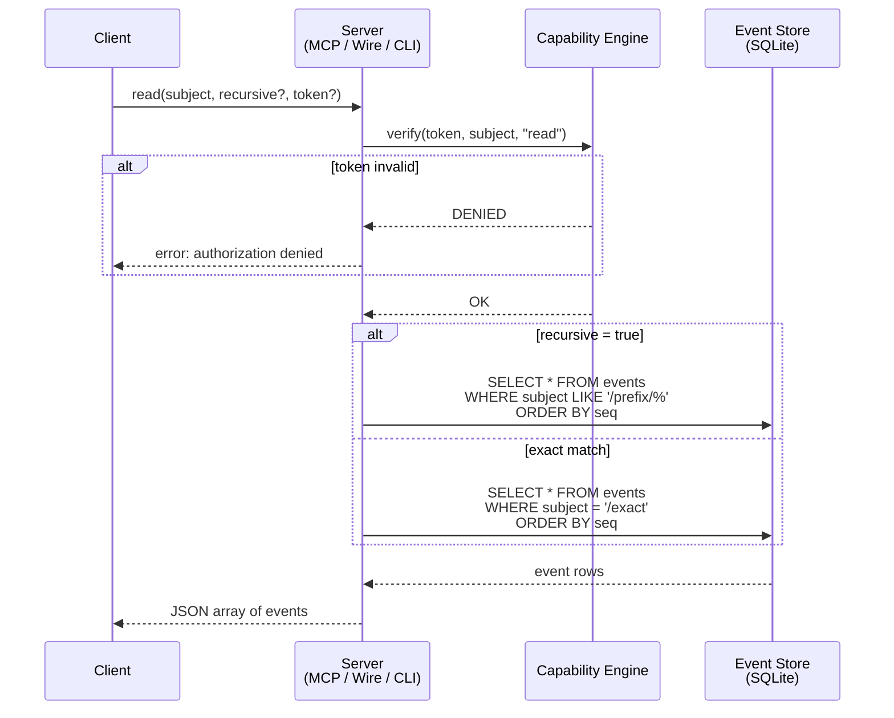
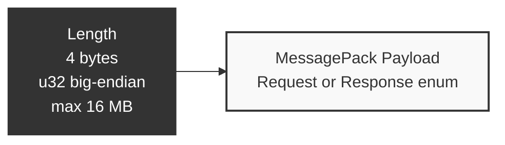

# Architecture

How ctxd works, how data flows through it, and how the pieces fit together. Written for engineers who want to understand, extend, or audit the system.

## What ctxd does

ctxd is a daemon that stores and serves context for AI agents. Context is anything an agent might need: notes, documents, customer data, code changes, meeting summaries, file contents. It enters as events, gets indexed into materialized views, and leaves via MCP tool calls, wire protocol queries, or HTTP endpoints.

One binary. SQLite by default — Postgres available for operators who want a managed datastore. No external services required.

Storage backends live behind the [`Store`](../crates/ctxd-store-core/src/lib.rs) trait (v0.3+); see ADR 017 for the conformance pattern that gates every backend, ADR 016 for the Postgres schema choices, and `docs/storage-postgres.md` for operator setup.

## System overview



## Data model

### Events

Everything in ctxd is an event. Events follow CloudEvents v1.0 with two extensions.

| Field | Type | Description |
|-------|------|-------------|
| `specversion` | `"1.0"` | Always 1.0 |
| `id` | UUIDv7 | Time-ordered, globally unique |
| `source` | string | Who produced this (e.g., `"ctxd://cli"`) |
| `subject` | string | Path-based address (e.g., `"/work/acme/notes"`) |
| `type` | string | Event kind (e.g., `"ctx.note"`) |
| `time` | RFC3339 | When the event was created |
| `datacontenttype` | string | Always `"application/json"` |
| `data` | JSON | Any JSON payload |
| `predecessorhash` | string | SHA-256 of previous event's canonical form (ctxd extension) |
| `signature` | string | Ed25519 signature (v0.2, ctxd extension) |

### Predecessor hash chain



Canonical form for hashing: exclude `predecessorhash` and `signature`, sort keys alphabetically, serialize to JSON bytes, SHA-256.

Hash chains are scoped per subject. Events on `/work/acme` and `/personal/journal` have independent chains. If any event is modified after the fact, the next event's predecessor hash will not match, and the chain breaks.

### Subjects

```
/                              root (parent of everything)
/work                          work namespace
/work/acme                     organization
/work/acme/customers/cust-42   specific entity
/personal/journal/2025-01-15   personal entry

Recursive read:
  read("/work/acme", recursive=true)
  matches: /work/acme, /work/acme/customers/cust-42, /work/acme/notes/standup
  does NOT match: /work/other, /working

Glob patterns (for capabilities):
  /**           everything
  /work/**      /work and all descendants
  /work/*       direct children of /work only (not grandchildren)
```

### Materialized views

All views are derived from the append-only event log and can be rebuilt from it.

| View | What it stores | Use case | Implementation |
|------|---------------|----------|----------------|
| **KV** | Latest event data per subject | "Current state of customer cust-42?" | SQLite table / Postgres row, UPSERT on append; LWW on `(time, id)` |
| **FTS** | Full-text index over event data | "Find everything mentioning 'enterprise plan'" | SQLite FTS5 virtual table; Postgres `tsvector` generated column + GIN |
| **Vector** | HNSW nearest-neighbor index | "10 most semantically similar events" | `hnsw_rs` 0.3 with on-disk sidecars (`<db>.hnsw.{graph,data,meta,map}`); rebuilt from `vector_embeddings` on corruption |
| **Graph** | Entities + relationships extracted from event payloads | "All events related to entity cust-42" | SQLite `graph_entities` + `graph_relationships` (mirrored in Postgres) |
| **Temporal** | Point-in-time event reconstruction | "What did `/work/acme/cust-42` look like on 2025-01-15?" | derived view over the events table by `time` predicate |

ctxd does NOT generate embeddings — the `Embedder` trait wraps OpenAI / Ollama / Null providers and the daemon stores whatever vector the embedder returns. Hybrid search (FTS + vector + Reciprocal Rank Fusion at `k=60`) is the default mode when an embedder is configured. See [embeddings.md](embeddings.md) and ADRs 014 / 015.

## Crate dependency graph



`ctxd-wire` is a leaf crate — it depends on `ctxd-core` for the `Event` type but is not depended on by anything inside the workspace except `ctxd-cli` (the binary) and the Rust SDK. Splitting it out means downstream consumers (the three SDKs, federation, embedded servers) can take a wire-protocol dep without dragging in storage, capabilities, MCP, or the HTTP admin.

## Capability model



Each level can only narrow scope. Never widen.

**Caveat types (v0.3):**

| Caveat | Purpose | State |
|--------|---------|-------|
| SubjectMatches | Glob pattern restricting which paths the token can access | static |
| OperationAllowed | Which operations: `read`, `write`, `subjects`, `search`, `admin`, `peer`, `subscribe` | static |
| ExpiresAt | Timestamp after which the token is invalid | static |
| KindAllowed | Restrict to specific event types (e.g., only `ctx.note`) | static |
| RateLimit | `ops_per_sec` cap, persisted 1-second windowed counter (ADR 011) | stateful |
| BudgetLimit | `(currency, amount_micro_units)` cumulative spend cap with per-op cost table | stateful |
| HumanApprovalRequired | Each verify for the named op blocks until a human decides | stateful |
| Third-party block | Authority-signed attenuation (e.g. `A → B → C` chain) verified via `verify_multi` | static |

Verification is datalog-injection-safe. All user inputs are validated against `"`, `)`, `;`, and newline before interpolation into biscuit authorizer code.

## Write path



All steps inside the transaction are atomic. Crash at any point = rollback, views stay consistent with the log.

## Read path



## Wire protocol framing



Every message on the TCP wire is length-prefixed. The length field is a 4-byte big-endian unsigned integer. The payload is a MessagePack-encoded request or response enum. Maximum payload size is 16 MB.

## SQLite schema

```sql
events             -- append-only event log: seq, id, source, subject, event_type, time,
                   --                       data, predecessorhash, signature, parents,
                   --                       attestation
event_parents      -- causal-DAG side table (event_id, parent_id) for parent backfill
kv_view            -- latest value per subject (subject PK, data, updated_at)
fts_view           -- FTS5 virtual table (event_id, subject, event_type, data)
graph_entities     -- materialized entities extracted from event payloads
graph_relationships -- edges between entities
revoked_tokens     -- biscuit token revocation list (token_id PK)
peers              -- federation peers (peer_id, public_key, url, scopes, …)
peer_cursors       -- last-seen cursor per peer for resume
token_budgets      -- BudgetLimit per (token_id, currency)
pending_approvals  -- HumanApprovalRequired queue (approval_id, decision, …)
rate_buckets       -- RateLimit 1-second windowed counter per token_id
vector_embeddings  -- raw vectors backing the persisted HNSW index
metadata           -- daemon config and ctxd_version stamp
```

Postgres mirrors the same logical tables with Postgres-native types (`UUID`, `JSONB`, `TIMESTAMPTZ`, `UUID[]`, `BYTEA`); see `docs/storage-postgres.md` and ADR 016 for the schema choices.

DuckDB+object-store keeps the event log as Parquet files behind an atomic `_manifest.json` and uses a SQLite sidecar for the same KV / peers / caveats / vectors / graph tables (ADR 018).

## Client SDKs

Three first-party SDKs ship at v0.3 alongside the daemon. All three pin to the same [`docs/api/`](api/) contract artifact (OpenAPI 3.1 + JSON Schema + MessagePack hex fixtures) and run the same conformance corpus, so a wire change either lands in every SDK or fails CI.

| Language | Package | Path | Source of truth |
|----------|---------|------|-----------------|
| Rust | `ctxd-client` (crates.io) | [`clients/rust/ctxd-client`](../clients/rust/ctxd-client/README.md) | yes |
| Python | `ctxd-client` on PyPI (imports as `ctxd`) | [`clients/python/ctxd-py`](../clients/python/ctxd-py/README.md) | mirrors Rust |
| TypeScript / JS | `@ctxd/client` on npm | [`clients/typescript/ctxd-client`](../clients/typescript/ctxd-client/README.md) | mirrors Rust |

The Rust SDK's API surface is the source of truth; Python and TypeScript mirror it method-for-method, with language-idiomatic naming and async ergonomics. The Rust workspace runs the same conformance harness in `crates/ctxd-wire/tests/conformance_corpus.rs` so the daemon is held to the same bar as the SDKs.

## What v0.3 does NOT include

| Feature | Target | Reason |
|---------|--------|--------|
| Full daemon over `dyn Store` for non-SQLite backends | v0.4 | Postgres + DuckDB run a minimal HTTP admin in v0.3 |
| Token-bucket rate limiting | v0.4 | v0.3 ships a hard 1-second windowed counter (ADR 011) |
| `budget_refund` for failed downstream ops | v0.4 | Reserve-then-commit semantics today (ADR 011) |
| Full TEE proof verification | v0.4 | Attestation field is canonicalized; verifier hook is optional (ADR 007) |
| pgvector / native vector indexes in Postgres | v0.4 | Brute-force cosine fallback today (ADR 016) |
| Slack, Notion, Linear, calendar adapters | v0.4 | Gmail + GitHub shipped in v0.3 |
| x402 HTTP 402 gateway integration | v0.4 | `BudgetLimit` enforces locally; HTTP-level micropayments are a separate protocol problem |
| DuckDB compaction / orphan-Parquet cleanup tool | v0.4 | `ctxd compact` is queued |
| Embedding generation | never | ctxd stores vectors, doesn't generate them |
