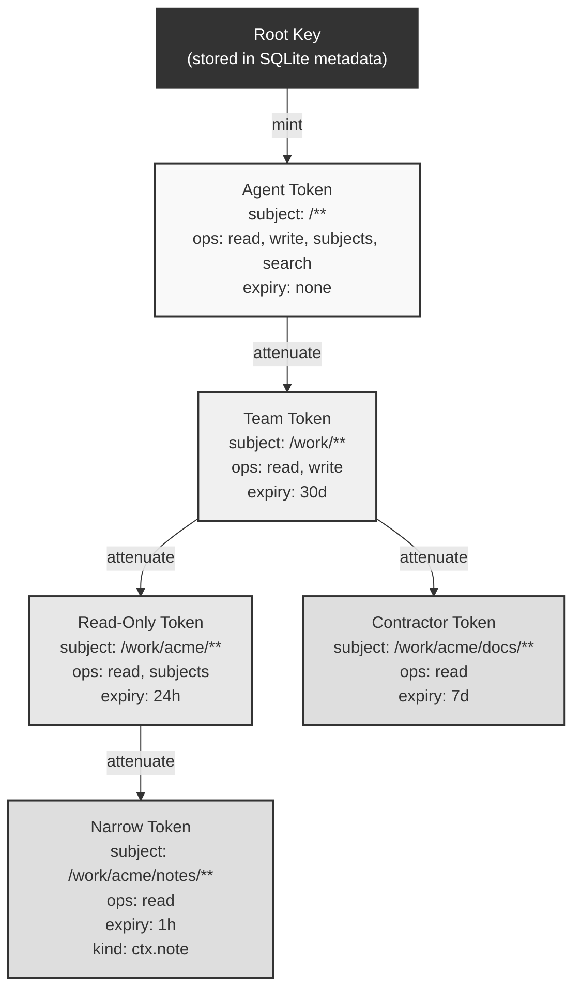
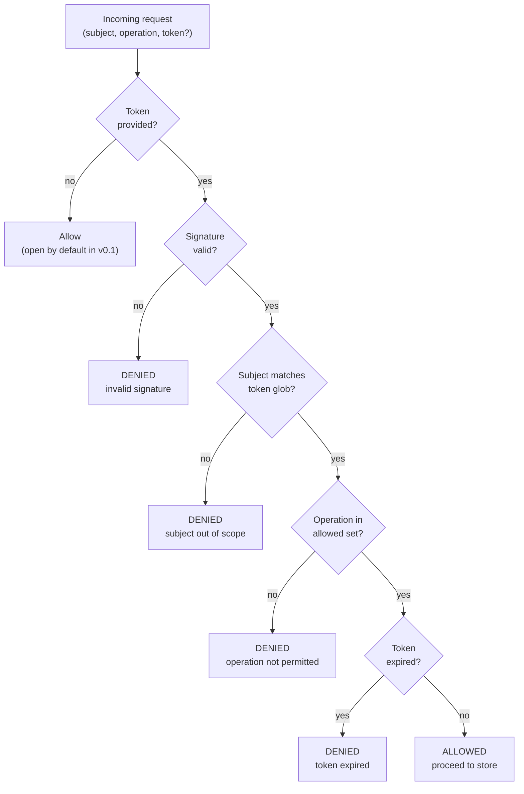

# Capabilities

ctxd uses capability-based authorization via [Biscuit tokens](https://www.biscuitsec.org/).

## Core concepts

- **Capabilities, not ACLs.** Access is granted by possessing a signed token, not by being on a list.
- **Attenuable.** A token holder can create a restricted version of their token (narrower scope, fewer operations) and pass it to someone else. They cannot widen it.
- **Bearer tokens.** Whoever holds the token can use it. Protect them like passwords.

## Operations

| Operation | Description |
|-----------|-------------|
| `read` | Read events from subjects |
| `write` | Append events to subjects |
| `subjects` | List subjects |
| `search` | Full-text search events |
| `admin` | Admin operations (mint new tokens) |

## Token attenuation

Tokens form a tree. Each child token is cryptographically bound to its parent and can only narrow scope, never widen it.



## Verification flow

Every operation (read, write, search, etc.) passes through the capability engine before reaching the event store.



## Minting

```bash
# Mint a token with full access
ctxd grant --subject "/**" --operations "read,write,subjects,search"

# Mint a read-only token scoped to /work/**
ctxd grant --subject "/work/**" --operations "read,subjects"
```

The token is output as a base64-encoded string.

## Verification

```bash
ctxd verify --token "<base64>" --subject "/test/hello" --operation read
```

## Attenuation

Tokens can be narrowed via the API. A token for `/**` with `read,write` can be attenuated to `/work/**` with `read` only. The attenuated token is cryptographically bound to the original.

## Caveat types

| Caveat | Description | Example |
|--------|-------------|---------|
| Subject glob | Restricts access to subjects matching a glob pattern | `/work/acme/**` |
| Operation set | Restricts to a set of operations | `read,subjects` |
| Expiry | Token becomes invalid after a timestamp | `2025-02-01T00:00:00Z` |
| Kind | Restrict to specific event types | `ctx.note` |
| Rate limit | Ops/sec cap (enforcement is v0.2) | `100` |
| **Budget limit (v0.3)** | Caps cumulative spend per token in micro-units of a currency | `BudgetLimit { currency: "USD", amount_micro_units: 1_000_000 }` |
| **Human approval (v0.3)** | Verifier blocks until a human decides via `ctxd approve` | `requires_approval(write)` |

## v0.3 stateful caveats

Static caveats (subject, operation, expiry) are pure functions of the
token. v0.3 adds two caveats that need a backing store —
`BudgetLimit` and `HumanApprovalRequired` — which the daemon plumbs
through a shared `CaveatState` trait. See [ADR-011](decisions/011-caveat-state-wiring.md)
for why the wiring landed this way and [ADR-012](decisions/012-approval-flow.md)
for the approval lifecycle.

### Budget limit

```rust
use ctxd_cap::state::{BudgetLimit, OperationCost};
use ctxd_cap::{CapEngine, Operation};

let engine = CapEngine::new();
let budget = BudgetLimit {
    currency: "USD".to_string(),
    // 1 USD == 1_000_000 µUSD. Costs from `OperationCost::*`:
    amount_micro_units: 50_000, // 0.05 USD = ~50 writes
};

let token = engine.mint_full(
    "/work/**",
    &[Operation::Write],
    None,                // no expiry
    None,                // no kind restriction
    None,                // no rate-limit fact
    Some(&budget),       // BudgetLimit caveat
    &[],                 // no approval requirements
)?;
```

When `verify_with_state` is called, each operation's
[`OperationCost`](https://docs.rs/ctxd-cap/) (read = 0, write = 1_000,
search = 1_000, timeline = 2_000) is charged against the
`(token_id, currency)` budget. The 51st write trips
`CapError::BudgetExceeded`.

The cost table is the verifier's prerogative — token holders cannot
forge a cheaper cost. To revisit the constants see ADR 011.

### Human approval required

```rust
use ctxd_cap::Operation;

// Mint a write-capable token that requires a human decision per
// invocation.
let token = engine.mint_full(
    "/prod/**",
    &[Operation::Write],
    None,
    None,
    None,
    None,
    &[Operation::Write],   // requires_approval for `write`
)?;
```

Each `verify_with_state` call for the gated operation:

1. Generates an `approval_id` (UUIDv7).
2. Records a row via `CaveatState::approval_request`.
3. Blocks via `CaveatState::approval_wait(approval_id, timeout)`.
4. Returns Ok only if the human decided `Allow`. Decisions of `Deny`
   surface as `CapError::ApprovalDenied`; the timeout fires as
   `CapError::ApprovalTimeout`.

There is no approval reuse across verifies. Each verify is an
independent request — see ADR 012.

#### Deciding approvals

CLI (works even when `ctxd serve` is down):

```bash
ctxd approve --id <uuid> --decision allow
ctxd approve --id <uuid> --decision deny
```

HTTP:

```bash
# List pending approvals
curl http://127.0.0.1:7777/v1/approvals

# Decide an approval
curl -X POST http://127.0.0.1:7777/v1/approvals/<uuid>/decide \
  -H 'content-type: application/json' \
  -d '{"decision":"allow"}'
```

The HTTP endpoint optionally accepts a `"token"` field with a
base64-encoded admin capability — required when the daemon is run
behind a guard, optional otherwise (open-by-default per ADR 004).

## v0.1 Limitations

- **No revocation in v0.1.** Revocation landed in v0.2 (`ctxd revoke`).
- **Expiry is optional.** Default: no expiry.
- **Open by default.** If no token is provided in an MCP tool call, the operation is allowed. Intentional for local development. See [ADR-004](decisions/004-open-by-default.md).
