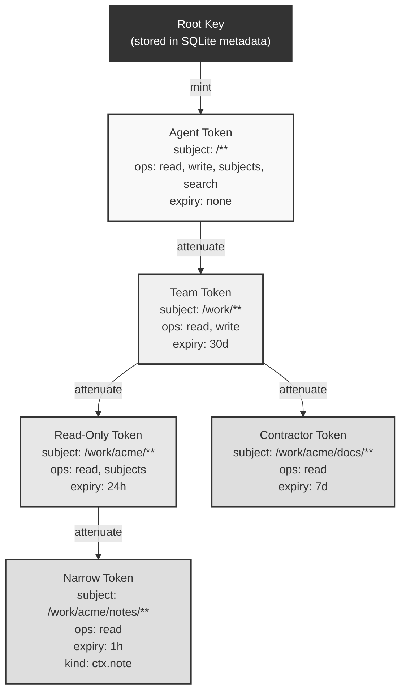
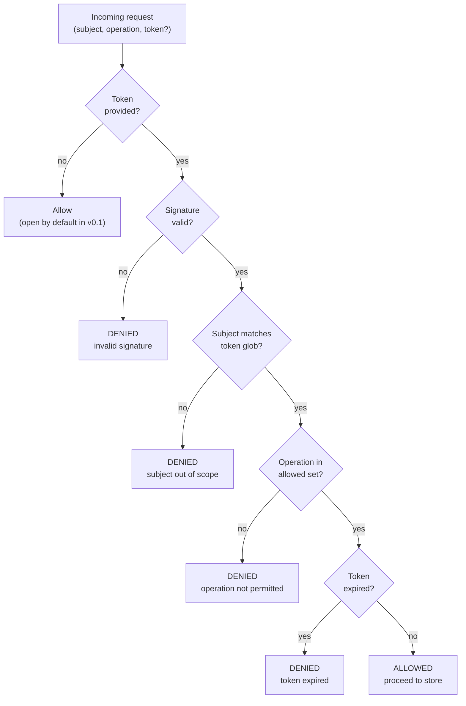

# Capabilities

ctxd uses capability-based authorization via [Biscuit tokens](https://www.biscuitsec.org/).

## Core concepts

- **Capabilities, not ACLs.** Access is granted by possessing a signed token, not by being on a list.
- **Attenuable.** A token holder can create a restricted version of their token (narrower scope, fewer operations) and pass it to someone else. They cannot widen it.
- **Bearer tokens.** Whoever holds the token can use it. Protect them like passwords.

## Operations

| Operation | Description |
|-----------|-------------|
| `read` | Read events from subjects |
| `write` | Append events to subjects |
| `subjects` | List subjects |
| `search` | Full-text search events |
| `admin` | Admin operations (mint new tokens) |

## Token attenuation

Tokens form a tree. Each child token is cryptographically bound to its parent and can only narrow scope, never widen it.



## Verification flow

Every operation (read, write, search, etc.) passes through the capability engine before reaching the event store.



## Minting

```bash
# Mint a token with full access
ctxd grant --subject "/**" --operations "read,write,subjects,search"

# Mint a read-only token scoped to /work/**
ctxd grant --subject "/work/**" --operations "read,subjects"
```

The token is output as a base64-encoded string.

## Verification

```bash
ctxd verify --token "<base64>" --subject "/test/hello" --operation read
```

## Attenuation

Tokens can be narrowed via the API. A token for `/**` with `read,write` can be attenuated to `/work/**` with `read` only. The attenuated token is cryptographically bound to the original.

## Caveat types

| Caveat | Description | Example |
|--------|-------------|---------|
| Subject glob | Restricts access to subjects matching a glob pattern | `/work/acme/**` |
| Operation set | Restricts to a set of operations | `read,subjects` |
| Expiry | Token becomes invalid after a timestamp | `2025-02-01T00:00:00Z` |
| Kind | Restrict to specific event types | `ctx.note` |
| Rate limit | Ops/sec cap (enforcement is v0.2) | `100` |

## v0.1 Limitations

- **No revocation.** A minted token is valid until it expires.
- **Expiry is optional.** Default: no expiry.
- **Open by default.** If no token is provided in an MCP tool call, the operation is allowed. Intentional for local development. See [ADR-004](decisions/004-open-by-default.md).
