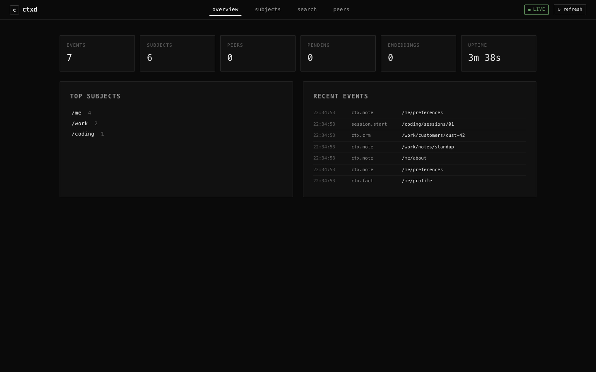
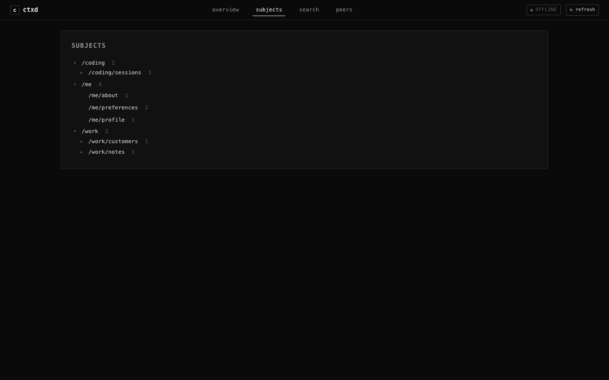

# ctxd dashboard

The dashboard is an embedded web UI that ships with the `ctxd` binary. It lets you see what's in your substrate at a glance: counts, recent events, the subject tree, full-text search, and federation peers. Read-only by default — writes still go through MCP, the wire protocol, or the CLI.

```bash
ctxd dashboard
```

That's it. Opens `http://127.0.0.1:7777/` in your default browser. Same database `ctxd serve` uses (default `~/.ctxd/ctxd.db`, override with `--db <path>`).

If `ctxd serve` is already running on `:7777`, point your browser there directly — the dashboard is part of the daemon, not a separate process. `ctxd dashboard` is just a convenience launcher when you're not running the full daemon.

## What you see



### Overview

Six counters at the top: events, subjects, peers, pending approvals, embeddings, uptime. Two panels below: top subjects (sorted by event count, capped to 10) and recent events (newest first, last 50, live-tailed).

The recent-events panel uses Server-Sent Events (`/v1/events/stream`) to push appends in real time. Open the dashboard, write an event from another terminal, watch it land in the panel within ~100ms with a flash on the timestamp. The live badge in the header reads `● live` when the SSE channel is open, `● reconnecting…` during a transient drop, `● offline` when the page isn't tracking.

When the substrate is empty, the recent-events panel becomes a one-button tutorial that writes a hello-world event for you. Click it to see what a populated dashboard looks like with zero ceremony.

### Subjects



Hierarchical view of your subject tree with cumulative counts. Clicking a node toggles its children. The top-level prefix defaults to `/`; pass `?prefix=/work` to drill in.

### Search

Full-text search via FTS5. Hits are ordered by BM25 relevance with `<mark>`-highlighted snippets. Searches are debounced (150 ms after typing stops) and the query is reflected into the URL fragment so refreshing the page keeps your search.

### Peers

Federated peers and pending approvals. Peer listing requires an admin capability token because federation metadata is sensitive — if the dashboard runs without one, the panel shows a hint about minting a token via `ctxd grant --operations admin`.

## Security model

The dashboard's threat model assumes:

- **The local user is trusted.** ctxd's posture is "your data, your machine."
- **The local network is untrusted.** The HTTP server binds `127.0.0.1:7777` only; nothing on the LAN can reach it.
- **Browsers loaded by the local user may visit malicious sites.** That's the real attack surface, and the dashboard's middleware exists to neutralize it.

Three defenses, layered:

### 1. Bind address

The daemon binds `127.0.0.1:7777` (and `[::1]:7777` on dual-stack hosts), never `0.0.0.0`. LAN reachability is not a configuration toggle.

### 2. Host header check

Every request must carry `Host: 127.0.0.1:7777` or `Host: localhost:7777`. Anything else gets a `421 Misdirected Request`. This is the primary defense against DNS rebinding: a malicious site that re-resolves its hostname to 127.0.0.1 still sends `Host: evil.com` in the request, and the rejection lands. Standard practice for loopback dev tools (Grafana, Jupyter, Cargo's local servers all do the same).

If you bind a non-default port, the daemon's allow-list won't match. Today this means non-default binds need a separate auth model; in v0.5 the allow-list will derive from the bind address.

### 3. Loopback-or-cap-token middleware

Every request goes through one check:

```
loopback peer (127.0.0.0/8 or ::1)?  yes → allow
                                     no  → require an admin cap-token
```

So:

- A browser on the same machine: passes (loopback) → reads `/v1/events`, `/v1/stats`, etc. without a token.
- A remote curl with a valid admin token: passes (cap-token) → can hit `/v1/grant`, `/v1/peers`, etc.
- Anyone else: rejected with 401/403.

The middleware needs the TCP peer address to make the loopback decision, so the daemon binds via `axum::serve(listener, router.into_make_service_with_connect_info::<SocketAddr>())`. If you're embedding ctxd-http in your own binary and forget that incantation, the middleware fails closed with a 500.

### Defensive headers

Every response carries:

```
Content-Security-Policy: default-src 'self'; script-src 'self'; style-src 'self'; img-src 'self' data:; connect-src 'self'; frame-ancestors 'none'
X-Content-Type-Options: nosniff
X-Frame-Options: DENY
Referrer-Policy: no-referrer
```

CSP forbids inline scripts, so `index.html` references `app.js` and `style.css` by URL only — no `<script>...</script>` blocks anywhere.

### What the dashboard explicitly does not trust

- `X-Forwarded-For` headers. Loopback decisions use the TCP peer address only. Reverse-proxy deployments (nginx in front of ctxd) need a different auth model and are out of scope for v0.4.
- The `Host` header alone. The host check is a second line of defense behind the bind-address restriction; it is not the only gate.

## When something looks broken

**Dashboard is blank** — open browser devtools. Check the network tab for failed `/v1/stats` or `/v1/events` requests. A 421 means the `Host` header doesn't match the allow-list (common when the daemon binds a non-default port). A 500 means the bind site forgot `into_make_service_with_connect_info`; this is a daemon bug, not a config issue.

**`ctxd dashboard` says port is in use** — another ctxd is already running on `:7777`. Visit that URL directly, or stop the existing daemon (`pkill ctxd`) and try again.

**Live tail shows `● offline` and never recovers** — the SSE connection failed and the auto-reconnect ran out (six retries). Click refresh. If it stays offline, the daemon's broadcast channel may be saturated; restart the daemon.

**Search returns nothing for terms you know are present** — FTS5 uses prefix matching only with explicit `term*` syntax. `auth` matches the literal token "auth", not "authentication". Search with `auth*` to match prefix.

**Empty state never goes away after clicking the tutorial button** — the POST to `/v1/dashboard/hello-world` may have hit the loopback gate or the host check. Check devtools. The endpoint is loopback-only by design; remote clients with a valid admin token are explicitly rejected.

## API endpoints the dashboard consumes

All endpoints are also reachable from cap-token HTTP clients (CLI scripts, ctxd-code, future satellites) — the dashboard is one consumer.

| Method | Path | Purpose |
|--------|------|---------|
| GET | `/v1/stats` | Counters and uptime. |
| GET | `/v1/events?limit=N&before=cursor&subject=` | Newest-first list with opaque cursor pagination. |
| GET | `/v1/events/{id}` | Single event detail. |
| GET | `/v1/events/stream` | Server-Sent Events live tail. |
| GET | `/v1/subjects/tree?prefix=` | Subject hierarchy with cumulative counts. |
| GET | `/v1/search?q=&k=` | FTS5 search with snippets, BM25-ranked. |
| GET | `/v1/peers` | Federation peers. **Admin token required.** |
| GET | `/v1/approvals` | Pending human approvals. |
| POST | `/v1/dashboard/hello-world` | One fixed event to `/dashboard/tutorial/hello`. **Loopback only.** |

The cursor on `/v1/events` is opaque base64 of `{"seq":N}`; clients should treat it as a black box and pass it through unchanged in `before=`.

## Out of scope for v0.4 (in TODOS.md)

- Subjects-as-graph view (entities + relationships). v2.
- Time-travel slider via `read_at`. v2.
- Vector / hybrid search UI. v2.
- Federation health metrics (replication lag, sync errors). v2.
- Capability-token UI (mint, revoke, scope viewer). v3, blocked on remote-auth model.
- Write actions beyond hello-world. v3.
- Light theme. v3.
- Mobile-first design. Bonus, not requirement.
