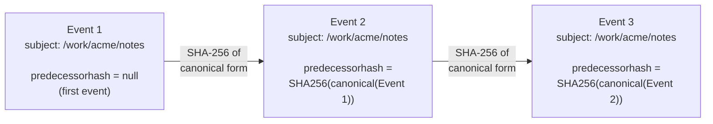

# Events

ctxd events follow the [CloudEvents v1.0 spec](https://cloudevents.io/) with ctxd-specific extensions.

## Schema

| Field | Type | Required | Description |
|-------|------|----------|-------------|
| `specversion` | string | yes | Always `"1.0"` |
| `id` | UUID (v7) | yes | Time-ordered unique identifier |
| `source` | string | yes | Origin of the event (e.g., `"ctxd://localhost:7777"`) |
| `subject` | string | yes | Path where the event is filed (e.g., `"/work/acme/customers/cust-42"`) |
| `type` | string | yes | Event type descriptor (e.g., `"ctx.note"`, `"demo"`) |
| `time` | RFC 3339 | yes | When the event was created |
| `datacontenttype` | string | yes | Content type of `data` (default: `"application/json"`) |
| `data` | JSON | yes | The event payload |
| `predecessorhash` | string | no | SHA-256 hash of the previous event's canonical form |
| `signature` | string | no | Ed25519 signature over canonical form |

## Example

```json
{
  "specversion": "1.0",
  "id": "019756a3-1234-7000-8000-000000000001",
  "source": "ctxd://localhost:7777",
  "subject": "/work/acme/customers/cust-42",
  "type": "ctx.note",
  "time": "2025-01-15T10:30:00Z",
  "datacontenttype": "application/json",
  "data": {
    "content": "Customer mentioned interest in the enterprise plan",
    "author": "user-1"
  },
  "predecessorhash": "a1b2c3d4e5f6..."
}
```

## Canonical Form (for hashing)

The canonical form excludes `predecessorhash` and `signature` to avoid circular dependencies. Keys are sorted alphabetically. The canonical JSON is serialized as bytes, then SHA-256 hashed.

Excluded fields: `predecessorhash`, `signature`
Included fields (sorted): `data`, `datacontenttype`, `id`, `source`, `specversion`, `subject`, `time`, `type`

## Hash chain integrity

Each subject maintains an independent hash chain. Events link to their predecessor via the `predecessorhash` field, creating a tamper-evident log.



**Tamper detection:** If someone modifies Event 1 after the fact, `SHA256(modified Event 1) != SHA256(original Event 1)`, so Event 2's `predecessorhash` no longer matches. The chain is broken, and the tampering is detectable.

**Per-subject scoping:** Events on `/work/acme` and `/personal/journal` have completely independent chains. Appending to one subject does not affect another subject's chain.

**Verification:** For each event with a `predecessorhash`, compute the hash of the previous event's canonical form and compare. If they don't match, the chain is broken at that point.

## Signatures

Events can be signed with Ed25519. The signature covers the same canonical form used for predecessor hashing. This proves the event was produced by the holder of the signing key and has not been modified.

```mermaid
flowchart TD
    subgraph "Signing (write time)"
        S1["Event fields\n(exclude predecessorhash, signature)"]
        S2["Sort keys alphabetically"]
        S3["Serialize to JSON bytes"]
        S4["Sign with Ed25519 private key"]
        S5["Hex-encode signature"]
        S6["Store in signature field"]

        S1 --> S2 --> S3 --> S4 --> S5 --> S6
    end

    subgraph "Verification (read time)"
        V1["Recompute canonical form"]
        V2["Serialize to JSON bytes"]
        V3["Hex-decode the stored signature"]
        V4["Verify against public key"]
        V5["Accept or reject"]

        V1 --> V2 --> V3 --> V4 --> V5
    end
```



The signing key is separate from the capability root key. Capabilities authorize operations. Signatures prove provenance. A single event can have both.
